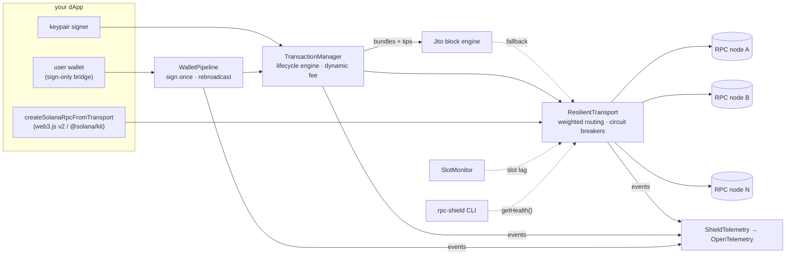

# solana-rpc-shield

[](https://www.npmjs.com/package/solana-rpc-shield)
[](https://github.com/architeuthis-defi/solana-rpc-shield/actions/workflows/ci.yml)
[](vitest.config.ts)
[](LICENSE)
[](package.json)

**A status-blind RPC node turns the send-and-retry pattern every Solana guide teaches into a double-send: 50 transactions land twice out of 50 while the user is told they all failed. `solana-rpc-shield` lands 100% with zero duplicates. One command reproduces both (`npm run sim:landing`).**

That funds-loss path is exactly what the canonical guides exist to prevent. Solana's
[official retry guide](https://solana.com/developers/guides/advanced/retry) and Helius's
["How to Land Transactions"](https://www.helius.dev/blog/how-to-land-transactions-on-solana) agree on
the recipe: send with `maxRetries: 0`, re-broadcast the *same signed bytes* every ~2s yourself,
re-sign **only after verified** blockhash expiry, use dynamic priority fees, and route around
degraded RPC nodes. Both guides document it; both leave the implementation to you
([`@solana/kit` ships failover transports only as cookbook examples](https://github.com/anza-xyz/kit)).
`solana-rpc-shield` is that recipe as a typed, tested SDK on the standard web3.js v2 / kit
transport seam, **provider-agnostic** where the existing alternatives are vendor-locked or DIY.

## 30-second quickstart

```bash
npm install solana-rpc-shield
```

```ts
import { createSolanaRpcFromTransport, createDefaultRpcTransport } from '@solana/kit'; // or '@solana/web3.js' v2
import { createResilientTransport, TransactionManager } from 'solana-rpc-shield';

const transport = createResilientTransport({
  endpoints: [
    'https://your-primary.rpc',   // any mix of providers — paid, free, self-hosted
    'https://your-secondary.rpc',
    'https://api.mainnet-beta.solana.com',
  ],
  // Recommended: the library's own transport keeps v2 wire semantics (bigint u64s);
  // the shield owns routing, health scoring and failover.
  transportFactory: ({ url }) => createDefaultRpcTransport({ url }),
});
transport.startHealthMonitor(); // background slot-lag probes — stale nodes get demoted

const rpc = createSolanaRpcFromTransport(transport);  // reads: failover is transparent
const manager = new TransactionManager(transport);    // writes: the landing recipe below
```

Works with **both package names**: `@solana/web3.js@2` and `@solana/kit` run the identical
compatibility matrix in [`test/e2e/kit-matrix.e2e.test.ts`](test/e2e/kit-matrix.e2e.test.ts) —
through real failover, bigint fidelity asserted.

## Where this sits

| | **solana-rpc-shield** | DIY on `@solana/kit` | [`helius-sdk`](https://github.com/helius-labs/helius-sdk) | [`gill`](https://github.com/gillsdk/gill) |
|---|---|---|---|---|
| Multi-endpoint failover | health-scored + circuit breakers + [slot-lag demotion](src/transport/health.ts) | [cookbook example](https://github.com/anza-xyz/kit) you copy & maintain | managed — **Helius endpoints only** | out of scope (deliberately minimal) |
| Rebroadcast + verified-expiry re-sign | [built-in, same-bytes](src/transaction/lifecycle.ts) | build yourself | smart transactions, vendor-managed | build yourself |
| Never-double-lands guarantee | [property-fuzzed invariant](test/sim/lifecycle.fuzz.test.ts) over RPC + Jito-relay sends ([model limits](docs/design-notes.md)) | — | not a stated / tested property | — |
| Wallet sign-once pipeline | [yes](src/wallet/wallet-pipeline.ts) (Wallet Standard + legacy bridge) | build yourself | n/a | no |
| Jito bundles + live tip accounts | [yes](src/transaction/transaction-manager.ts) | build yourself | via Helius Sender | no |
| Works with **any** provider mix | yes — bring 2+ URLs | yes | no | yes |
| OpenTelemetry metrics | [yes](docs/observability.md) | no | no | no |

*If you're all-in on Helius, use `helius-sdk` — it automates this well inside that stack. `gill` is
an ergonomics layer, not a reliability engine — complementary, not competing. The shield is for
everyone who wants the documented landing behaviour across any providers, including free public
endpoints.*

## What the guides say → where the shield implements it

| Canonical guidance | Source | Implemented at |
|---|---|---|
| Send with `maxRetries: 0`; own the retry loop client-side | [Solana docs](https://solana.com/developers/guides/advanced/retry) | [`submitViaRpc`](src/transaction/transaction-manager.ts) (`maxRetries: 0`) + [lifecycle engine](src/transaction/lifecycle.ts) |
| Re-broadcast the **same signed bytes** on a ~2s cadence until expiry | [Helius guide](https://www.helius.dev/blog/how-to-land-transactions-on-solana) | [`runTxLifecycle`](src/transaction/lifecycle.ts) rebroadcast loop · [test](test/sim/transaction-manager.test.ts) |
| Re-sign only after `lastValidBlockHeight` has verifiably passed | [Solana docs](https://solana.com/developers/guides/advanced/retry) | two all-null full-history sweeps + grace window before any re-sign · [cross-node tests](test/sim/cross-node.test.ts) |
| Don't trust one-shot confirmation — it has a history of lying | [#23949](https://github.com/solana-labs/solana/issues/23949), [#25955](https://github.com/solana-labs/solana/issues/25955) | status polling over **all** submitted signatures, `searchTransactionHistory` death sweeps |
| Dynamic priority fees, never fixed | [Helius guide](https://www.helius.dev/blog/how-to-land-transactions-on-solana) | [`PriorityFeeEstimator`](src/transaction/priority-fee.ts) percentile + clamps + [pluggable external source](src/transaction/priority-fee.ts) |
| Don't `skipPreflight` blindly | [Solana docs](https://solana.com/docs/rpc/http/sendtransaction) | default `false`; rebroadcasts skip (already validated) |
| Jito: tip inside the transaction, accounts fetched live | [docs.jito.wtf](https://docs.jito.wtf/lowlatencytxnsend/) | [`getTipAccounts`/`submitBundle`](src/transaction/transaction-manager.ts), never a hardcoded list |

## Measured evidence

Why injected failures, not an organic mainnet A/B: a healthy network cannot tell a resilient
client from a naive one — over any window where nothing breaks, both land everything.
Resilience is measured by *injecting* the failure modes and checking the invariants hold.
The shield injects them twice: deterministically, against real local HTTP servers
(`npm run sim:landing` — the table below reproduces bit-for-bit), and against **live mainnet
nodes** — `rpc-shield simulate-drop`: real endpoints, a real injected outage, real failover
and circuit recovery (this recording deliberately mixes mainnet + devnet, so the shield's
chain-mismatch detection fires too):


**Landing-rate A/B** — `npm run sim:landing`, 50 intents × 5 failure scenarios over real local
HTTP servers sharing one truth ledger. The *naive* client is the tutorial pattern implemented
fairly: one endpoint, send, poll, and on timeout re-sign a fresh transaction.

**Under a status-blind node the naive pattern double-lands every one of 50 intents — 100 needless
signatures on-chain — while reporting total failure; the shield lands 100% with zero duplicates.**

| Scenario | Client | Landed | Lost | **Double-lands** | Extra signatures | Median confirm |
|---|---|---|---|---|---|---|
| **status-blind node** (hot polls lag 450ms) | naive | 100% | 0% | **50** | 100 | — |
| | **shield** | **100%** | 0% | **0** | 0 | 465ms |
| endpoint outage (25% of intents) | naive | 74% | 26% | **0** | 0 | 3ms |
| | **shield** | **100%** | 0% | **0** | 0 | 8ms |
| latency spike (50% of intents) | naive | 100% | 0% | **0** | 0 | 361ms |
| | **shield** | **100%** | 0% | **0** | 0 | 7ms |
| rate-limit bursts (30% of intents) | naive | 70% | 30% | **0** | 0 | 2ms |
| | **shield** | **100%** | 0% | **0** | 0 | 5ms |
| blackhole (20% of intents) | naive | 80% | 20% | **0** | 0 | 3ms |
| | **shield** | **100%** | 0% | **0** | 0 | 4ms |

The first row is the funds-loss bug the lifecycle engine exists to kill: a status-blind node makes
the naive client believe nothing landed, so it re-signs, and both copies land. The user is shown
*failure* and retries again. Counts are deterministic (failure assignment by intent index), so the
table reproduces bit-for-bit. *Deterministic local-server simulation, not mainnet — the point is
exact reproducibility; live fault injection is the `simulate-drop` recording above.*

**Property-based fuzz** — [~650 randomized cluster schedules per CI run](test/sim/lifecycle.fuzz.test.ts)
(node status lag, height skew, blockhash propagation delay, landing delays, reverts, drops, an
external pre-submitter racing the first send) on a virtual clock. Headline invariant: **never
double-lands**, plus truthful-confirm, resign-only-after-verified-death, truthful-failure,
termination. In plain words: ~650 hostile cluster scenarios per CI run — clock skew, lying
status endpoints, racing pre-submitters — and in none of them does the engine ever land the
same intent twice ([model boundary](docs/design-notes.md)). The fuzz guards against a vacuous
pass: the external-pre-submitter property asserts the racing client *actually* forced an
`already been processed` reply (`expect(ap).toBeDefined()`) — if that hostile path never fires,
the test fails instead of going green on an empty run.

**Live bench** against the three official clusters (2026-06-11, EU residential network — a
single low-rate pass, n=12; at higher request rates the public clusters rate-limit *all*
comers, and no client-side failover can conjure capacity out of a fully throttled pool —
that regime is what the rate-limit landing scenario above measures):

```
TARGET                                        REQS  ERRS  MIN     P50     P95     P99     MAX     RPS
https://api.mainnet-beta.solana.com           12    0     27ms    31ms    149ms   149ms   149ms   49.4
https://api.devnet.solana.com                 12    0     24ms    24ms    79ms    79ms    79ms    75.9
https://api.testnet.solana.com                12    0     110ms   111ms   429ms   429ms   429ms   15.6
shield composite (3 endpoints)                12    0     23ms    29ms    151ms   151ms   151ms   45.3
```

## Architecture



| Module | Responsibility | Judging axis |
|---|---|---|
| `transaction/` — [lifecycle engine](src/transaction/lifecycle.ts) + `TransactionManager` | The landing recipe: signature-set tracking, same-bytes rebroadcast, verified-death re-sign, bounded `Blockhash not found` retry with verbatim error surfacing, Jito relay/bundles, dynamic fees | **Correctness** |
| `transport/` — `ResilientTransport` | Multi-endpoint pool, per-node health (latency EWMA · slot-lag · error class), circuit breakers, score-proportional weighted routing | **Resilience** |
| `wallet/` — `WalletPipeline` + bridges | Wallet-signed txs: sign **once**, rebroadcast same bytes, re-prompt only after verified expiry and only opt-in. Wallet Standard (Phantom/Solflare/Backpack) + legacy adapter | **Correctness / DX** |
| `observability/` — `ShieldTelemetry` | OpenTelemetry: requests/latency/failovers, tx + bundle outcomes, wallet prompt counts, per-endpoint gauges → [docs/observability.md](docs/observability.md) | **DX** |
| `cli/` — `rpc-shield` | `health` · `watch` · `bench` · `tx` · `simulate-drop` | **DX** |
| `test/` | Real-server network sims + cross-node **consistency** sims + property fuzz + landing-rate A/B | **Tests** |

## The transaction lifecycle (the core of Correctness)

One logical send = up to `maxAttempts` blockhash epochs:

1. **Sign once per epoch**, submit with `maxRetries: 0`; a `Blockhash not found` preflight from a
   lagging node is retried (bounded), every other node answer surfaces **verbatim** as
   `RpcSubmitError` (code, message, simulation logs). One exception is a *success* in disguise:
   `already been processed` means the ledger HAS these bytes — the signature is derived locally
   from the wire ([`signatureOfWire`](src/transaction/wire.ts), the node's error body doesn't
   carry it) and confirmed like any landed transaction instead of being reported as a failure.
2. **Poll all submitted signatures** every 2s; **re-broadcast the same signed bytes** on the same
   cadence (leader rotates every ~1.6s). Rebroadcast errors are non-authoritative — the status
   poll is the truth.
3. **Expiry is verified, never guessed**: suspected only when block height passes
   `lastValidBlockHeight` *plus a safety margin* (nodes skew a few blocks apart), then confirmed
   by **two all-null full-history sweeps** over every signature this call ever submitted,
   separated by a grace window. A transaction that landed late is *returned*, not double-signed.
4. **A timeout is terminal** — `TransactionTimedOutError` carries all signatures so you can keep
   watching; re-signing on a wall-clock guess is how double-sends happen.
5. Lifetime is an engine parameter, not an assumption: under a `durableNonce` lifetime expiry
   semantics vanish — no expiry checks, no re-sign path, one signature by construction. The
   public `TransactionManager` ships blockhash-first; the nonce surface is a documented seam
   ([design notes](docs/design-notes.md)).

The same engine drives the keypair path and the wallet path — one implementation, one fuzz target.
Jito **bundles** confirm through their own bounded polling — a separate, narrower path by design
([design notes](docs/design-notes.md)); the fuzzed invariant covers RPC and Jito-relay sends.

## Health scoring & traffic distribution (the core of Resilience)

- **Latency** — EWMA per request · **Slot lag** — distance behind the freshest node in the pool
  (a fast node serving stale state is "up" but wrong) · **Error rate** — windowed, with
  timeouts/5xx/rate-limits classified distinctly · **Circuit breaker** — quarantine with
  exponential backoff, half-open probes.
- The default `routing: 'weighted'` draws each request's failover order by **score-proportional
  sampling without replacement**, damped by in-flight load — every healthy node carries a share,
  so no endpoint sees your full request rate (always hammering the single best node *provokes*
  the 429s the shield exists to avoid). `routing: 'best'` + per-endpoint `weight` gives strict
  paid-primary/free-backup ordering.
- Caller aborts (unmount, route change) are **not** endpoint faults: no health penalty, no
  failover — three page navigations can't trip your circuit breakers.
- **Chain-mismatch detection:** the monitor groups endpoints by genesis hash, compares slot lag
  only within a chain, and the CLI warns when a pool accidentally mixes mainnet with devnet —
  a real misconfiguration that would otherwise silently poison routing scores. `rpc-shield tx`
  goes further: it checks the signature on **every** chain of a mixed pool, because a
  single-routed read landing on the wrong chain returns an authoritative-looking NOT FOUND.

## Wallet integration

Wallets sign — the shield submits. A wallet's own `signAndSendTransaction` goes through its single
internal RPC: no failover, no fee strategy, no rebroadcast. The bridge takes **sign-only** access
(and refuses wallets that can't), then the pipeline owns the lifecycle:

```ts
import { TransactionManager, WalletPipeline, fromWalletStandard } from 'solana-rpc-shield';

const signer = fromWalletStandard(wallet); // Phantom, Solflare, Backpack — sign-only
const pipeline = new WalletPipeline(new TransactionManager(transport), signer);

const result = await pipeline.sendAndConfirm({
  buildTx: (blockhash) => buildMyTransferTx(blockhash), // unsigned serialized tx
  resignOnExpiry: false, // extra popups are opt-in — and only after VERIFIED expiry
});
```

The user is prompted **once**; rebroadcasts reuse the same signed bytes. A transaction that lands
during death verification is returned without a second prompt. Legacy `@solana/wallet-adapter`
bridges with one line (`fromLegacyAdapter(adapter, { deserialize: VersionedTransaction.deserialize })`).
Runnable: [demo dApp](examples/demo-dapp/) — consumes the SDK as a built package, live health
panel, intentionally dead endpoint in the pool.

## CLI

```
rpc-shield health   -e <a,b,c>               # one-shot per-node health scoreboard
rpc-shield watch    -e <a,b,c> [-i 2000]     # live-refreshing scoreboard (real-time monitor)
rpc-shield bench    -e <a,b,c> [-n 30 -c 4]  # raw endpoints vs. shield composite: p50/p95/p99, errors, rps
rpc-shield tx <sig> -e <a,b,c>               # signature status through the resilient pool
rpc-shield simulate-drop -e <a,b> -d <a> \
    --after 2 --duration 4 -n 20             # inject a failure window, watch failover + circuit recovery
```

Endpoints can also come from `RPC_SHIELD_ENDPOINTS`.

`simulate-drop` against **live nodes** — the victim starts failing, faults get classified, the
circuit opens, requests keep landing through the survivor, the window closes and traffic returns
(recorded live in [Measured evidence](#measured-evidence) above). Sample output:

```
#  3 ok via https://api.mainnet-beta.solana.com 29ms
--- DROP WINDOW OPEN: https://api.mainnet-beta.solana.com now failing ---
#  5 ok via https://backup-node.example.com 41ms  (failed over past: https://api.ma…ta.solana.com:network)
...
final health:
ENDPOINT                                      CIRCUIT    SCORE  LATENCY  ERR-RATE SLOT-LAG  IN-FLIGHT
https://api.mainnet-beta.solana.com           OPEN       0.00   52ms     67%      0         0
https://backup-node.example.com               CLOSED     0.86   44ms     0%       0         0
```

## Scope decisions (deliberate)

Declared limits beat discovered ones — full reasoning in [docs/design-notes.md](docs/design-notes.md):

- **WebSocket subscriptions: out of scope by design.** One-shot WS confirmation has a documented
  history of lying ([#23949](https://github.com/solana-labs/solana/issues/23949),
  [#25955](https://github.com/solana-labs/solana/issues/25955)); polling against a health-scored
  pool is the strictly-more-robust path for a *reliability* library. Layer push UX on top if you
  want it — confirmation truth stays poll-based.
- **SWQoS, stated precisely:** a client SDK cannot *create* stake-weighted QoS. Your endpoint
  list IS the routing policy — point an entry at a staked **full RPC** endpoint and submissions
  route through SWQoS that already exists. Bare send-only sender URLs (which would fail reads
  and be demoted by health scoring) are the planned `extraSenders` seam. No overclaim.
- **Fee estimator limits:** `getRecentPrioritizationFees` reports per-slot **minimums** — a floor
  heuristic. For latency-critical flows plug a provider percentile API via
  `priorityFee.source` (result still clamped — an API outage can't bid zero or runaway).
- **Fan-out submission:** racing the same bytes across K endpoints is safe **only** with full
  signature-set tracking — without it, a race is a double-send factory. The tracking is the
  hard part, and it is shipped and fuzzed; the race itself is a documented seam, deferred
  rather than bolted on ([design notes](docs/design-notes.md)).
- **Durable nonces:** the engine models lifetime as `'blockhash' | 'durableNonce'` — under a
  nonce, expiry semantics vanish by construction. The public manager ships blockhash-first;
  the nonce surface (account setup, advance discipline, its own fuzz scenarios) is a
  documented seam ([design notes](docs/design-notes.md)).

## Verify it yourself — 15 minutes

```bash
git clone https://github.com/architeuthis-defi/solana-rpc-shield && cd solana-rpc-shield
npm ci
npm test                 # 173 tests: unit + real-server e2e + cross-node consistency + fuzz
npm run test:cov         # 98.2% lines / 92.6%+ branches measured; CI fails below a 90%/85% floor
npm run sim:landing      # the landing-rate A/B table above, reproduced deterministically
npx tsx examples/resilient-reads.ts   # the quickstart live: reads through a pool with a dead node
npm run cli -- health -e https://api.mainnet-beta.solana.com,https://api.devnet.solana.com
npm run cli -- simulate-drop -e https://api.mainnet-beta.solana.com,https://api.devnet.solana.com \
  -d https://api.mainnet-beta.solana.com --after 2 --duration 4 -n 12 -i 500
npx tsx examples/otel-console.ts          # OTel metrics flowing from live devnet traffic
# wallet demo (Phantom/Solflare/Backpack + devnet):
npm run build && cd examples/demo-dapp && npm install && npm run dev
```

Public endpoints rate-limit aggressively — that's part of the demonstration: watch the fault
classification and the failover absorb it. Behind a locked-down proxy, everything above the
CLI lines runs fully offline (the test suite never touches the network).

## License

[MIT](LICENSE)
